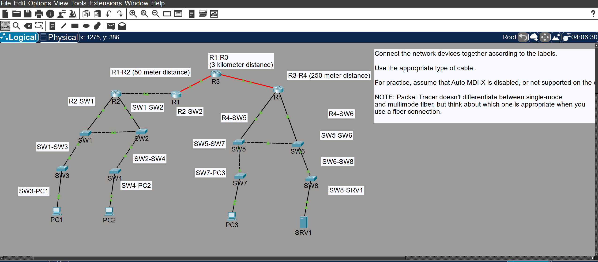

# CCNA Lab: 4-Router Backbone with VLANs, Trunking, and OSPF

A Cisco Packet Tracer lab built while studying for CCNA — a 4-router backbone connecting two switched clusters, each running inter-VLAN routing, with OSPF providing dynamic routing across the whole topology.

## Topology



```
                    PC1 (VLAN 10)         PC3 (VLAN 30)
                     |                     |
        SW3 -- SW1 -- SW2 -- SW4          SW7 -- SW5 -- SW6 -- SW8
              (trunks)  |                        (trunks)  |
                        R2                                 R4
                        |                                  |
                 192.168.1.0/24                     192.168.3.0/24
                        |                                  |
                        R1 ------------------------------- R3
                            192.168.2.0/24

  PC2 (VLAN 20) hangs off SW2/SW4 via R2's second subinterface
  SRV1 (VLAN 40) hangs off SW6/SW8 via R4's second subinterface
```

- **Backbone:** R1 – R2, R1 – R3, R3 – R4 (physical router-to-router links)
- **Left cluster (behind R2):** SW1–SW4, PC1, PC2 — two VLANs
- **Right cluster (behind R4):** SW5–SW8, PC3, SRV1 — two VLANs, mirrors the left cluster

## Addressing scheme

Simple `/24` per link (no VLSM — kept deliberately simple for a first lab):

| Link / Segment              | Network           | Notes                                  |
|------------------------------|-------------------|-----------------------------------------|
| R1 <-> R2                   | 192.168.1.0/24     | R1 = .1, R2 = .2 (FastEthernet0/0)      |
| R1 <-> R3                   | 192.168.2.0/24     | R1 Gi3/0 = .1, R3 Gi2/0 = .2            |
| R3 <-> R4                   | 192.168.3.0/24     | R3 Gi3/0 = .2, R4 Gi3/0 = .1            |
| VLAN 10 "SW1-SIDE" (PC1)    | 192.168.4.0/24     | Gateway: R2 Fa1/0 = .1                  |
| VLAN 20 "SW2-SIDE" (PC2)    | 192.168.5.0/24     | Gateway: R2 Fa2/0 = .1                  |
| VLAN 30 "SW5-SIDE" (PC3)    | 192.168.6.0/24     | Gateway: R4 Fa0/0 = .1                  |
| VLAN 40 "SW6-SIDE" (SRV1)   | 192.168.7.0/24     | Gateway: R4 Fa1/0 = .1                  |

## What's configured

- **Physical links:** all backbone and access links wired and verified up/up. The router model used has RJ45-only Gigabit interfaces (no fiber module installed), so even the longer-distance backbone links use copper cross-over cable instead of fiber.
- **VLANs & trunking:** each cluster has two access VLANs (one per switch pair) carried over trunk links between switches, with the router acting as the inter-VLAN gateway via two separate physical interfaces (router-on-a-stick style, but using dedicated interfaces rather than subinterfaces).
- **Inter-VLAN routing:** verified within each cluster (e.g. PC1 <-> PC2 through R2, PC3 <-> SRV1 through R4) using only directly-connected routes.
- **OSPF (single area, area 0):** enabled on all four routers (process ID 1) to dynamically advertise every subnet — backbone links and all four VLAN subnets — without any static routes.

## Verification

- All OSPF adjacencies confirmed `FULL` via `show ip ospf neighbor` on each router pair (R1↔R2, R1↔R3, R3↔R4).
- End-to-end connectivity proven with a ping from **PC1 (192.168.4.10)** to **SRV1 (192.168.7.10)** — traffic crosses 3 routers and 2 VLAN boundaries using routes learned entirely via OSPF:

  ```
  Pinging 192.168.7.10 with 32 bytes of data:

  Request timed out.
  Reply from 192.168.7.10: bytes=32 time=24ms TTL=124
  Reply from 192.168.7.10: bytes=32 time=82ms TTL=124
  Reply from 192.168.7.10: bytes=32 time=11ms TTL=124

  Ping statistics for 192.168.7.10:
      Packets: Sent = 4, Received = 3, Lost = 1 (25% loss)
  ```

  (First reply times out due to ARP resolution — expected on a fresh ping. TTL=124, down from a starting value of 128, confirms the packet crossed 4 router hops.)

## Files

- `ccna-lab-r1-r4-ospf-vlans.pkt` — the Packet Tracer save file. Open with Cisco Packet Tracer to explore the live topology and device configs.
- `configs/` — `show running-config` output for each router (R1–R4) and switch (SW1–SW8).
- `topology.png` — screenshot of the topology from Packet Tracer.

## Possible follow-ups

- Extend with ACLs to restrict traffic between specific VLANs (e.g. PC1 ⟷ SRV1 allowed, PC1 ⟷ PC3 blocked) as the next CCNA topic.
